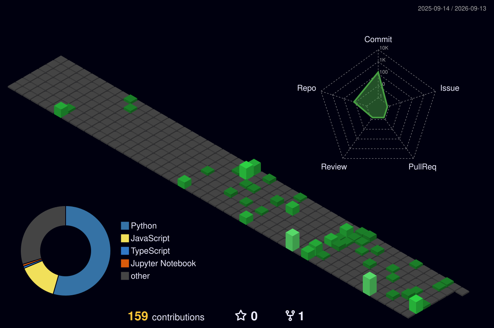

<header> <h1 align="center"></h1> </header>

## Languages & Technology :computer:

                                      

## Leetcode Statistics :chart_with_upwards_trend:

## Contact Me 📲

    

<!DOCTYPE html>
<html lang="en">
<head>
<meta charset="UTF-8">
<title>Walking Human Simulation</title>

</head>
<body>

  <h1>🚶 Walking Human Simulation</h1>
  <label>Speed (steps/sec): 1.0</label>
  <input id="speed" type="range" min="0.2" max="3" step="0.1" value="1.0">

  <label>Stride length: 1.0</label>
  <input id="stride" type="range" min="0.5" max="1.6" step="0.05" value="1.0">

  <label>Height (px): 220</label>
  <input id="height" type="range" min="120" max="320" step="5" value="220">

  

    <button id="pauseBtn">Pause</button>
    <button id="resetBtn" class="secondary">Reset</button>
  

<canvas id="stage"></canvas>

procedural walk-cycle · foot swing + lift, character moves across screen

</body>
</html>

